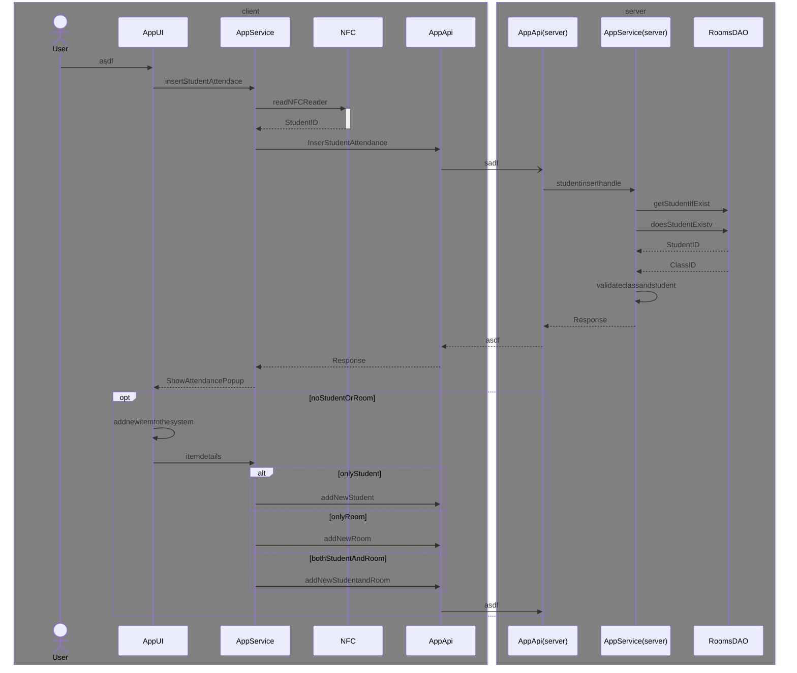

```mermaid

sequenceDiagram

box gray client 
actor User
participant AppUI
participant AppService
participant NFC
participant AppApi
end

box gray server
participant sAppApi as AppApi(server)
participant sAppService as AppService(server)
participant RoomsDAO
%% participant DB


end


User->>AppUI: asdf
AppUI->>AppService: insertStudentAttendace
AppService->>+NFC: readNFCReader
NFC-->>-AppService: StudentID
AppService->>AppApi: InserStudentAttendance
AppApi-)sAppApi: sadf
sAppApi->>sAppService: studentinserthandle
sAppService->>RoomsDAO: getStudentIfExist
sAppService->>RoomsDAO: doesStudentExistv
RoomsDAO-->>sAppService: StudentID
RoomsDAO-->>sAppService: ClassID
sAppService->>sAppService: validateclassandstudent
    sAppService-->>sAppApi:Response
    sAppApi-->>AppApi: asdf
    AppApi-->>AppService:Response
    AppService-->>AppUI: ShowAttendancePopup

opt noStudentOrRoom

    AppUI->>AppUI: addnewitemtothesystem
    AppUI->>AppService: itemdetails
    alt onlyStudent
        AppService->>AppApi:addNewStudent
    else onlyRoom
        AppService->>AppApi:addNewRoom
    else bothStudentAndRoom
        AppService->>AppApi:addNewStudentandRoom
    end
	    AppApi->>sAppApi: asdf
end


```